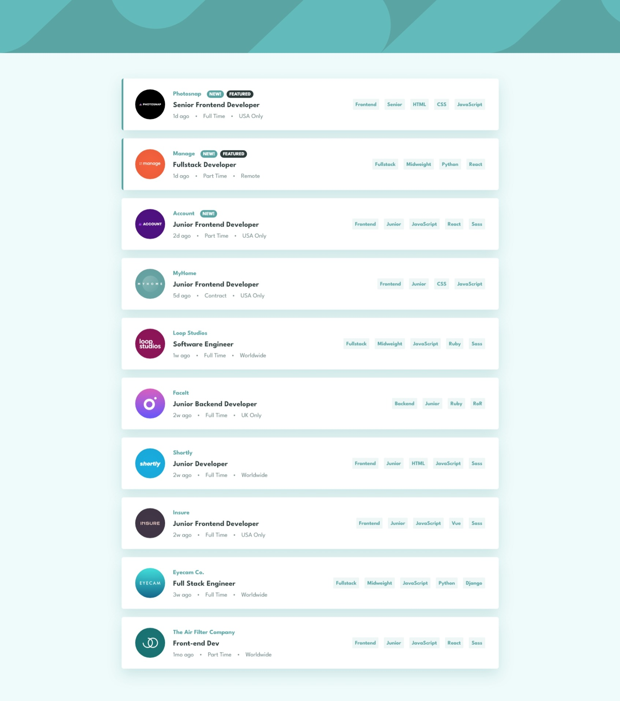
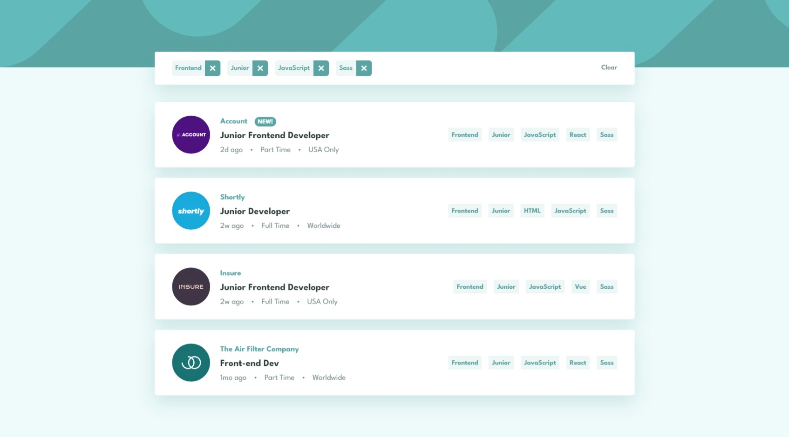
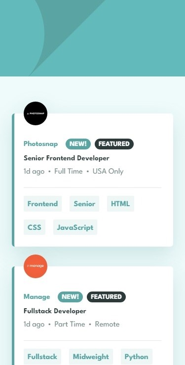
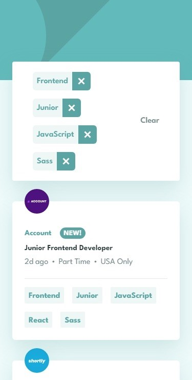

# Frontend Mentor - Job listings with filtering solution

This is a solution to the [Job listings with filtering challenge on Frontend Mentor](https://www.frontendmentor.io/challenges/job-listings-with-filtering-ivstIPCt). Frontend Mentor challenges help you improve your coding skills by building realistic projects. 

## Table of contents

- [Overview](#overview)
  - [The challenge](#the-challenge)
  - [Screenshot](#screenshot)
  - [Links](#links)
- [My process](#my-process)
  - [Built with](#built-with)
- [Author](#author)

## Overview

### The challenge

Users should be able to:

- View the optimal layout for the site depending on their device's screen size
- See hover states for all interactive elements on the page
- Filter job listings based on the categories

### Screenshot

#### 1. Desktop Interface - Unfiltered

#### 2. Desktop Interface - Filtered

#### 3. Mobile Interface - Unfiltered

#### 4. Mobile Interface - Unfiltered

### Links

- Solution URL: [Github](https://github.com/anindyoo/frontend-mentor_3-static-job-listings-challenge-solution-)
- Live Site URL: [Github Pages](https://your-live-site-url.com)

## My process

### Built with

- Semantic HTML5 markup
- [Tailwind CSS](https://tailwindcss.com/)
- [React](https://reactjs.org/) - JS library
- [Heroicons](https://heroicons.com/) - For icons

## Author

- Frontend Mentor - [@anindyoo](https://www.frontendmentor.io/profile/anindyoo)
- Twitter - [@anindyo_](https://www.twitter.com/anindyo_)

